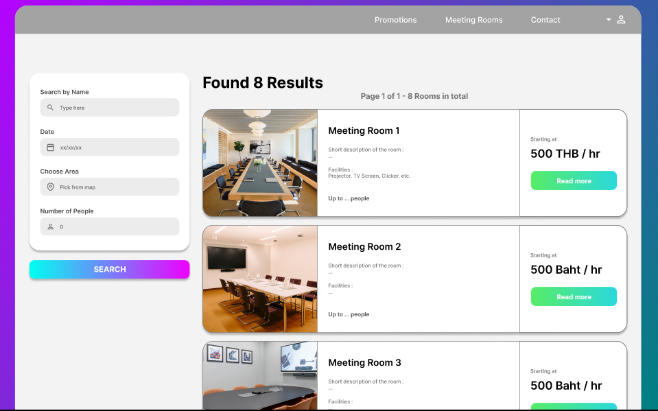

# **RoomEase – Smart Meeting Room Booking System**  

## **Project Overview**  
RoomEase is an intuitive and efficient web platform designed to streamline the process of booking meeting rooms. Users can easily search for available rooms using advanced filters, compare pricing, and find the best spaces that match their specific requirements. The system ensures a seamless experience by offering a user-friendly interface, real-time availability updates, and secure booking options.  

## **Key Features**  
- **Advanced Search & Filters** – Users can filter meeting rooms by location, capacity, price range, amenities (Wi-Fi, projectors, whiteboards, catering, etc.), and availability.  
- **Interactive Map & Area Search** – Locate rooms within specific regions and compare options visually.  
- **Real-Time Availability & Booking** – See updated room availability and book instantly with a secure payment system.  
- **User Reviews & Ratings** – Get insights from previous users to ensure the best experience.  
- **Admin & Host Dashboard** – Room providers can list, manage, and update room details while tracking bookings.  
- **Price Comparison & Deals** – View the best deals and compare prices to find budget-friendly options.  

## **Technology Stack**  
- **Frontend**: React.js / Vue.js for a dynamic and responsive UI  
- **Backend**: Node.js / Django / Flask for handling requests and database operations  
- **Database**: PostgreSQL / MongoDB for storing user and booking data  
- **Authentication**: OAuth / Firebase Authentication for secure user login  
- **Maps & Location Services**: Google Maps API for location-based searches  
- **Payment Integration**: Stripe / PayPal for secure transactions  

## **Target Users**  
- Businesses looking for flexible and affordable meeting spaces  
- Freelancers and remote workers needing private meeting areas  
- Event organizers seeking venues for conferences, workshops, or corporate gatherings  

## **Project Goals**  
- Create a seamless and efficient booking experience for users  
- Enable businesses and individuals to find cost-effective meeting spaces with ease  
- Provide a robust management system for venue owners to list and maintain their spaces  

## **Smart Chatbot System**

